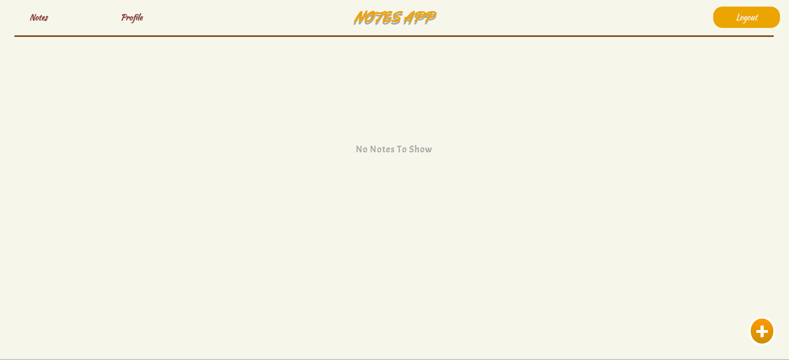
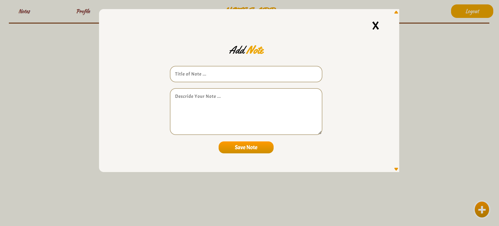
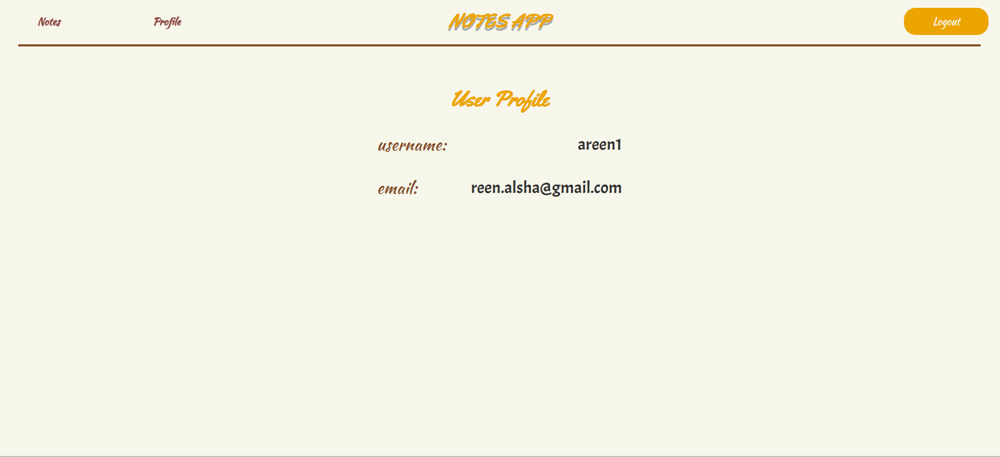
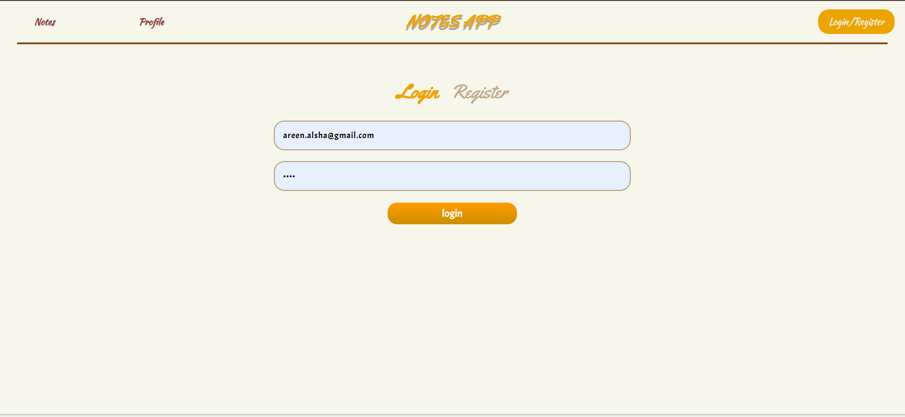
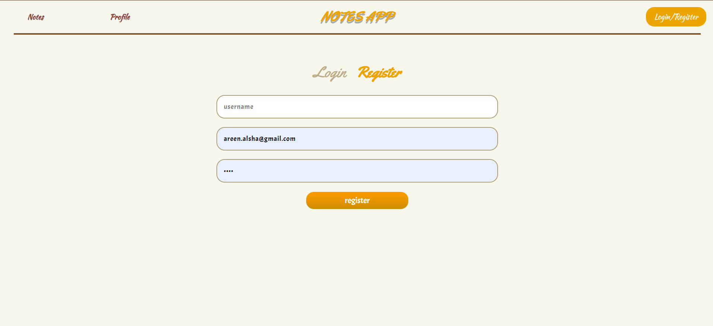

## 📝 Notes App
## 💡 Project Idea
The Notes App is a full-stack web application designed to help users easily write, save, edit, and delete personal notes.

It features a clean, modern interface that’s intuitive and user-friendly, making note-taking simple and efficient.

## 🛠️ Technologies Used
React.js – Builds a dynamic and responsive user interface.

Node.js – Powers the server-side logic.

Express.js – Handles API routing and backend structure.

MongoDB – Stores note data securely and efficiently.

## ⚙️ How It Works
Users interact with the React-based frontend to manage their notes.

Notes are sent to the backend via Express and Node.js..

The backend stores and retrieves data from MongoDB.

Users can view, update, or delete their notes anytime.
## Screenshots
## Home Page

## Add Notes

## Profile

## Login & Register

## ✅ Result
A fully functional MERN-stack Notes App that empowers users to manage their thoughts and tasks with ease.

It demonstrates the power of modern JavaScript technologies in building scalable, interactive web applications.

## 🚀 Live Demo

our site is live at: [https://areen-118.github.io/notes-app](https://areen-118.github.io/notes-app)
